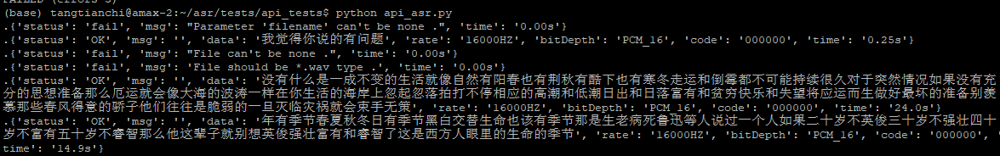

**短时间在线60s语音识别项目(wenet+paddle(添加标点符号)+flask+uwsgi+docker)**

模型推理： REST_Engine

服务配置：uwsgi.ini

模型配置：conf(下载语音的预训练模型放到这个文件夹下)  Puntuation(下载paddle的标点符号模型放到这个文件夹下)

语音处理：端点检测分割长段语音(REST_Engine/VAD_Warpper.py)

可以根据自己的需求用python的subprocess+FFmpeg进行对输入语音进行自动转化，比如位深度转化，降采样等等，这一部分我没有放上来。注：标准音频采样率16K,BitDepth:PCM_16

效果展示：

